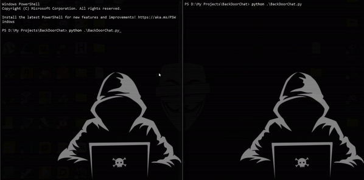

# Backdoor CLI Chat

A command-line interface chat application with real-time messaging capabilities.



## Features

- 🔒 Client-server architecture
- 🚀 Real-time messaging
- 💻 Command-line interface
- 📝 Multiple commands support
- 🌐 Network-capable (local and internet)

### Available Commands

- `!help` - Show all available commands
- `!active` - List all active users in the chat
- `!clear` - Clear the screen
- `!whoami` - Show your current username
- `!time` - Show current server time
- `!room` - Show current room name

## Requirements

- Python 3.6+
- No external dependencies required (uses standard library only)

## Installation

1. Clone the repository:
```bash
git clone https://github.com/yourusername/backdoor-chat.git
cd backdoor-chat
```

2. Make sure you have Python 3.6 or higher installed:
```bash
python --version
```

## Usage

### Starting the Server

```bash
# Basic server start (default port: 55555)
python chat.py --server

# Custom port and room name
python chat.py --server --port 5000 --room hackroom

# Bind to specific IP
python chat.py --server --host 0.0.0.0 --port 5000
```

### Connecting as a Client

```bash
# Connect to local server
python chat.py

# Connect to specific server
python chat.py --host server-ip --port 5000
```

### Command Line Arguments

- `--server`: Run as server
- `--host`: Host address to connect to or bind on (default: 127.0.0.1)
- `--port`: Port number (default: 55555)
- `--room`: Chat room name (default: main)


## Future Features

- [ ] End-to-end encryption
- [ ] Private messaging
- [ ] File sharing capabilities
- [ ] Multiple chat rooms
- [ ] User authentication
- [ ] Custom themes
